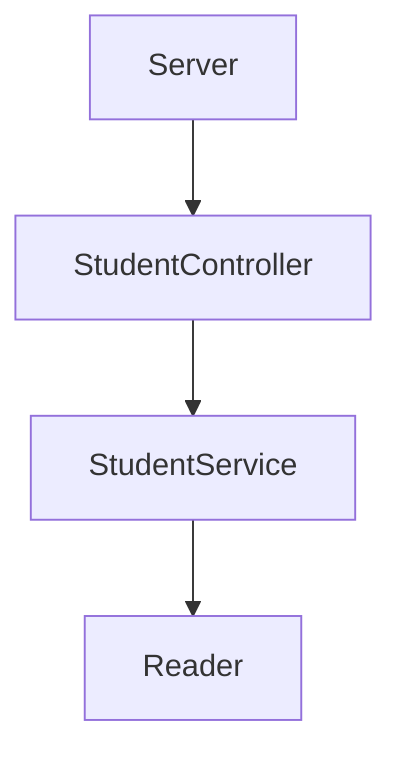
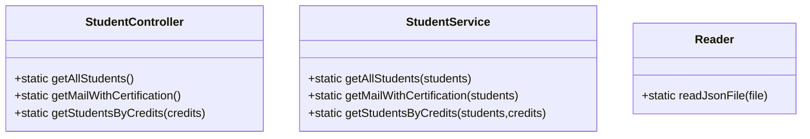

# Code Challenger LaunchX
En este proyecto desarrollaremos un API de consulta de acuerdo a una serie de requerimiento solicitadoa por una empresa, es buen ejemplo de lo que tendriamos como una prueba técnica para desarrollador Back-End o como una solicitud de un cliente para integrar nuevas funcionalidades a sus sistemas existentes.

## Requerimiento Original por parte de Visual Partner-Ship 

Requerimientos:
 - Habilitar un endpoint para consultar todos los estudiantes con todos sus campos.
 - Habilitar un endpoint para consultar los emails de todos los estudiantes que tengan certificación *haveCertification*.
 - Habilitar un endpoint para consultar todos los estudiantes que tengan credits mayor a 500.
  
# Diseño de componentes
Se ha diseñado un API con 3 endpoints diferentes, para ello se ocupa un divide el flujo donde el componente *Server* es el encargado de recibir las peticiones y direccionarlas al Controlador *StudentController* que a su vez hace uso del Servicio *StudentService* que utiliza un componente *Reader* para leer el archivo con los datos en formato JSON.

Para cumplir los requerimientos se diseñaron 3 clases

## StudentController
- static getAllStudents() .- Obtiene la lista de todos los estudiantes.
- static getMailWithCertification() .- Obtiene la lista de correos de los estudiantes con certificacion (haveCertification).
- static getStudentsByCredits(credits) .- Obtiene la lista de estudiantes con creditos mayores a *credits*.
## StudentService
- static getAllStudents(students) .- Obtiene la lista de todos los estudiantes del arreglo de objeto *students*.
- staticgetMailWithCertification(students) .- Obtiene la lista de correos de los estudiantes con certificacion (haveCertification) del arreglo de objeto *students*.
- static getStudentsByCredits(students,credits) .- Obtiene la lista de estudiantes con creditos mayores a *credits* del arreglo de objeto *students*.
## Reader
- static readJsonFile .- Lee un archivo JSON y regresa los datos en un objeto para poder ser consultado.

# Dependencias
<ul>
  <li>JEST</li>
  <li>Eslint</li>
  <li>Express</li>
  <li>Apidoc</li>
</ul>

# Instalación
npm install

# Para ejecutar pruebas unitarias
npm run test
# Actualizar documentación 
npm run apidoc

# Para ejecutar el proyecto
npm run server

# Acceder al servidor para ver la funcionalidad
Desde el navegador abrir la URL:  localhost:3000 con cualquiera de los endpoints.

# End points
- */v1/students* : Lista la información completa de todos los estudiantes.
- */v1/studentsCertificated* : Lista los correos de los alumnos certificados.
- */v1/studentsWithCredits* : Lista la información completa de los alumnos que tengan mas de 500 créditos.

# Funcionamiento
Se muestran los 3 endpoints funcionando desde el navegador:

# Documentación del API
En esta liga se encuentra la documentación de como utilizar los endpoints del API y ejemplos de uso.
[link](https://hectorsampieri.github.io/students-SV-API/apidocs/)

# Cobertura de lineas de código por las pruebas unitarias
En esta liga se encuentra la documentación de como se cumple la cobertura de código con pruebas unitarias (100%) .
[link](https://hectorsampieri.github.io/students-SV-API/coverage/lcov-report/)

