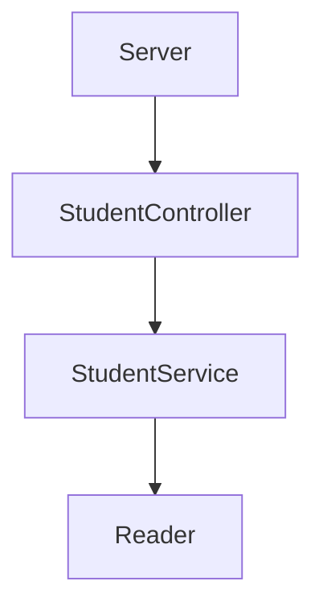
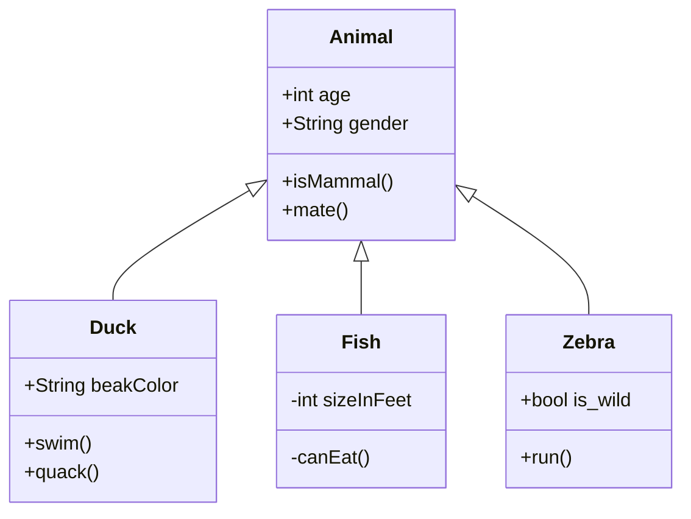

# Code Challenger LaunchX
Visual Partner-Ship te ha asignado el siguiente proyecto:
Requerimientos:

 - Habilitar un endpoint para consultar todos los estudiantes con todos sus campos.
 - Habilitar un endpoint para consultar los emails de todos los estudiantes que tengan certificación haveCertification.
 - Habilitar un endpoint para consultar todos los estudiantes que tengan credits mayor a 500.
  
# Diseño de componentes
Se ha diseñado un API con 3 endpoints diferentes, para ello se ocupa un divide el flujo donde el componente *Server* es el encargado de recibir las peticiones y direccionarlas al Controlador *StudentController* que a su vez hace uso del Servicio *StudentService* que utiliza un componente *Reader* para leer el archivo con los datos en formato JSON.

Para cumplir los requerimientos se diseñaron 3 clases

# Dependencias
# Funcionamiento del API
